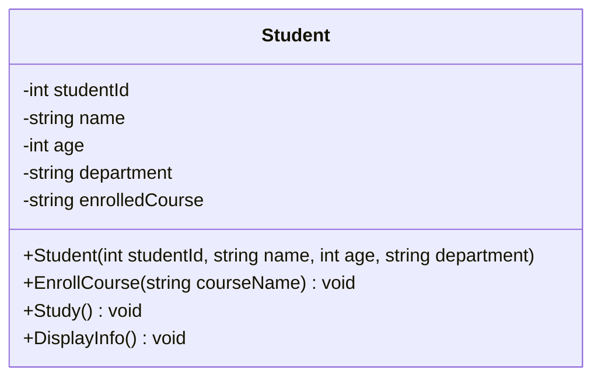

```mermaid
classDiagram
    class Student {
        -int studentId
        -string name
        -int age
        -string department
        -string enrolledCourse
        +Student(int studentId, string name, int age, string department)
        +EnrollCourse(string courseName) void
        +Study() void
        +DisplayInfo() void
    }
```
